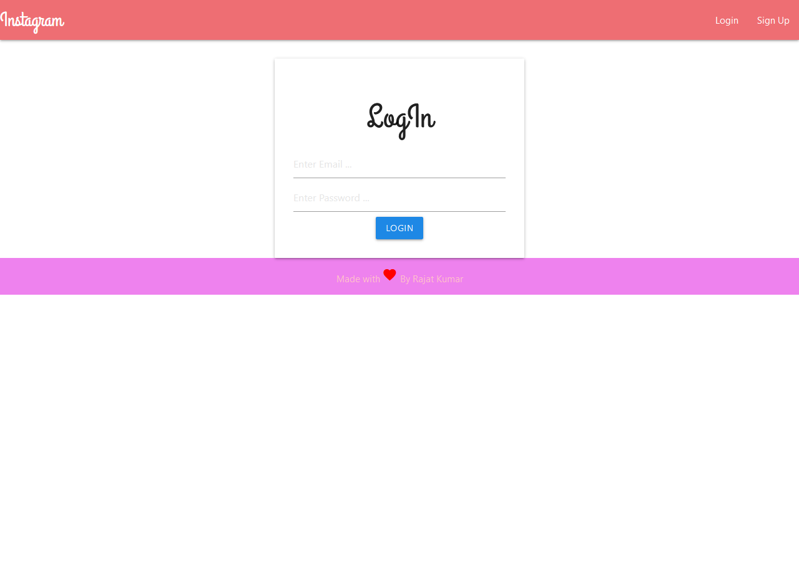
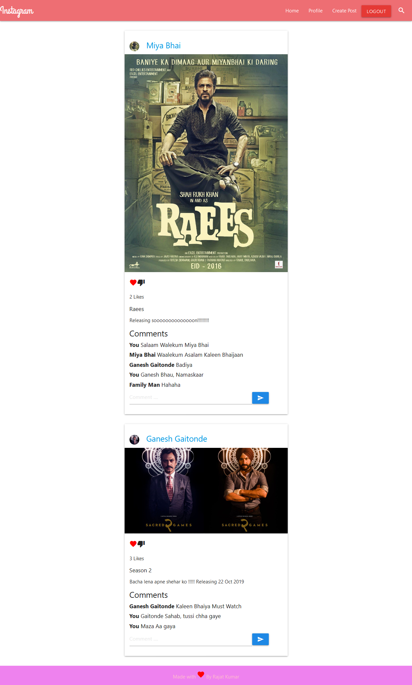
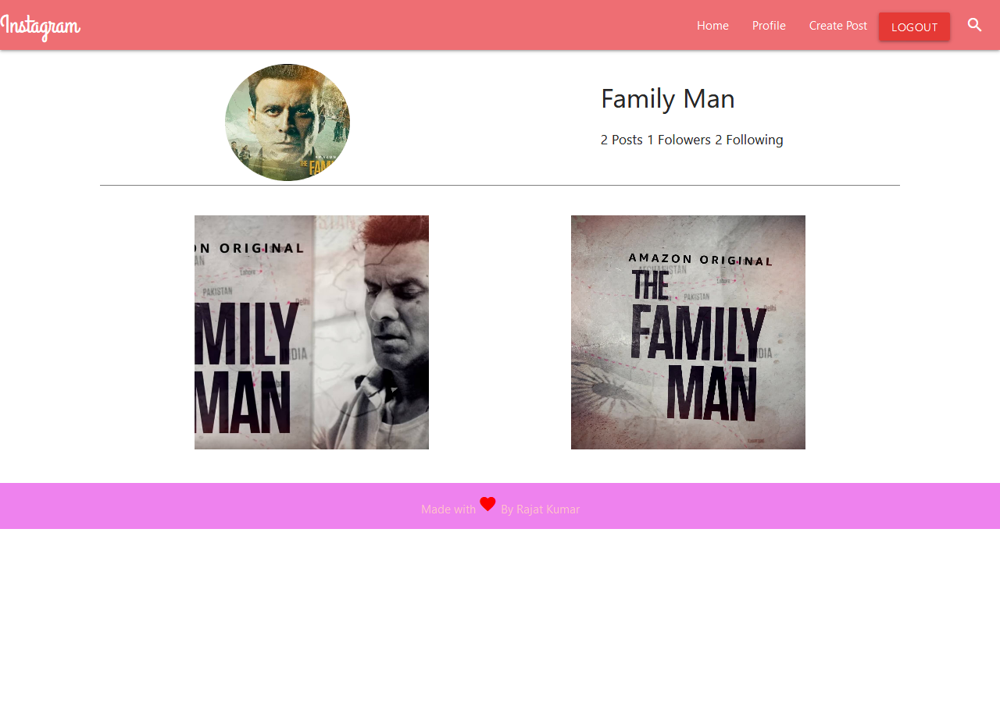
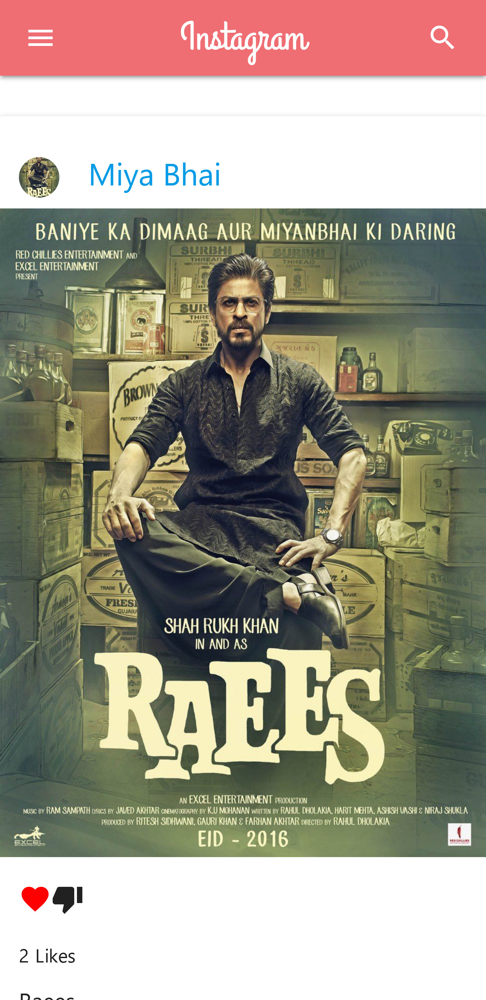

# Instagram Clone
  * Made using MERN Stack.
  * Used materialize-css for styling in React framework
  * Cloudinary for storing images
  * Deployed on Heroku server.
  * [Try it Now!!!!](https://instaclone1998.herokuapp.com/ "Named link title") 
# Login

# Home

# Profile

# Mobile Home

